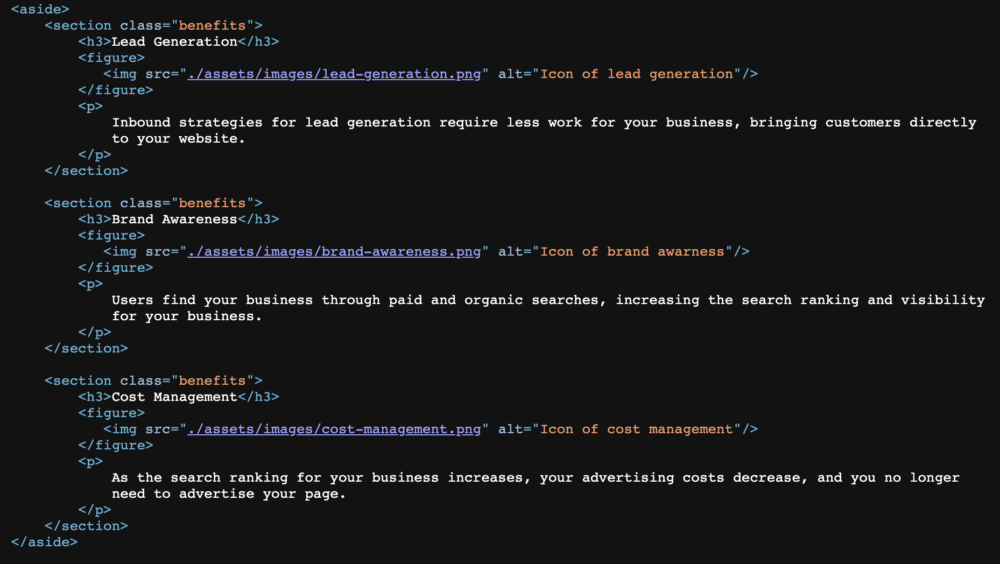

# Refactor html code

## Description 

In this project, I was given a starter code that needed to be refactored for **accessibility** purposes.

I have improved the codebase for long-term sustainability, and made sure all lines of code are layed out in a readable fashion.

The following steps have been taken to meet accessibility standards: 

* Semantic HTML elements can be found throughout the source code
* HTML elements follow a logical structure independent of styling and positioning
* Image and icon elements contain accessible `alt` attributes
* Heading attributes fall in sequential order
* Title elements contain a concise, descriptive title

I have learned that web accessibility is an important consideration for businesses, and that accessible sites are better positioned in search engines, such as Google.

It is also best practice for every web developer to take the appropriate steps to ensure that everybody, including people with disabilities, can access their website. 

## Installation

N/A

## Usage

Each section of this webpage has been adapted to meet accessibility requirements. Inspect the code to understand what assistive technologies need in order to read webpages.

Deployed website: https://ginacamelia.github.io/refactor-html-code/

## Credits

N/A

## License
Please refer to Licence in the repo.